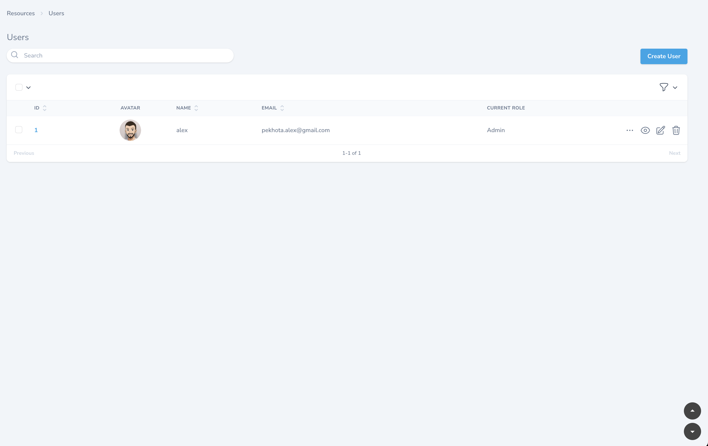

# Nova Scroll Buttons

Adds always-visible scroll-to-top and scroll-to-bottom buttons to every Laravel Nova page.

[](https://packagist.org/packages/pekhota/nova-scroll-buttons)  
[](LICENSE)

---

## Features

- Instantly scroll to the top or bottom of any Nova page
- Always visible, floating buttons in the bottom-right corner
- Simple and lightweight, blends with any Nova theme
- Zero configuration — works out of the box

---

## Screenshot



---

## Dependencies

- **Laravel Nova**: ^5.0
- **PHP**: ^8.1
- **Laravel Framework**: ^10.0, ^11.0, or ^12.0

## Installation

Run this command in your project folder:

```shell
composer require pekhota/nova-scroll-buttons
```

---

## Usage

No setup required!  
Once installed, the scroll-to-top and scroll-to-bottom buttons will appear on every Laravel Nova page automatically.

---

## Customization

Want to change the button style or placement?  
You can easily edit the Vue component in your own fork and update its markup and styles.

---

## Changelog

See CHANGELOG.md for recent changes.

---

## Contributing

Contributions are welcome! Please open an issue or pull request if you have ideas or find bugs.

---

## License

This package is open-sourced software licensed under the MIT license.

---

## Credits

Inspired by the need for quick navigation in complex Nova dashboards.  
Built by [@pekhota](https://github.com/pekhota).

## Acknowledgements

Special thanks to [Oleh Cherbaiev](https://www.linkedin.com/in/oleg-cherbaiev-1b6485220/) for valuable help
improving the component.
